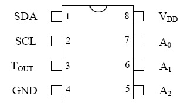
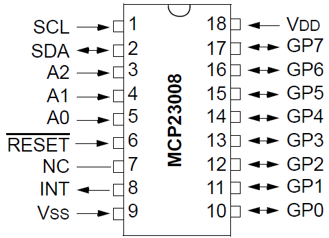
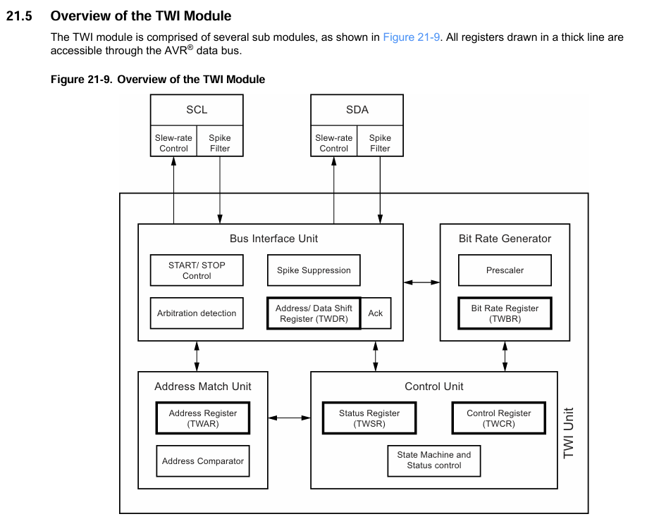
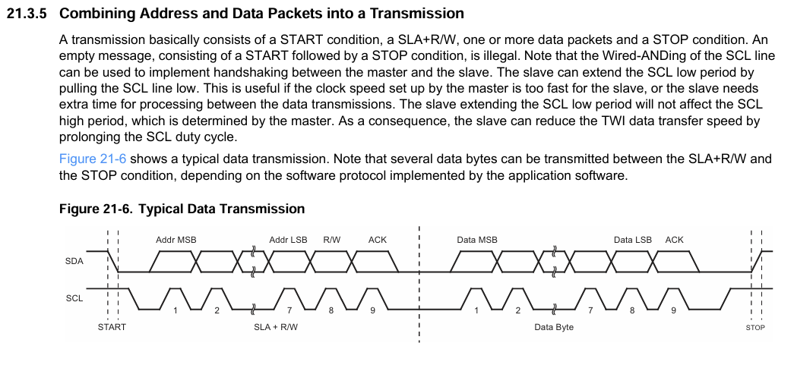
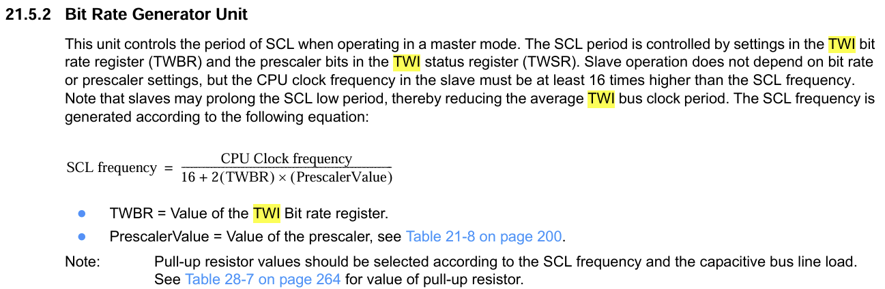
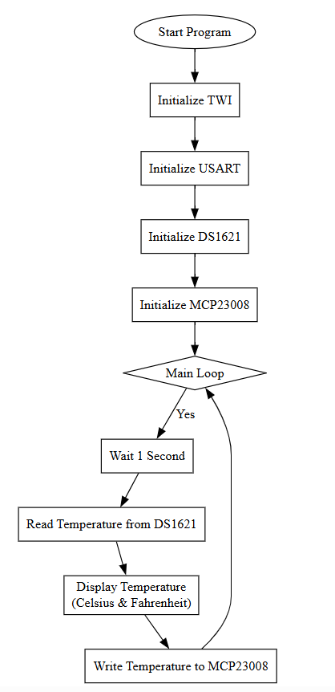

# I2C devices connected to Arduino UNO (Atmega328p)

This project demonstrates how to connect and interface two I²C devices with an Arduino Uno (powered by the ATmega328P microcontroller) using **Embedded C** in **Atmel Studio / Microchip Studio**. 

## Overview

This project introduce you to:
- Understanding **I²C communication protocols** and how they work.
- Interpreting and utilizing microcontroller **datasheets** [ATmega328p](https://ww1.microchip.com/downloads/en/DeviceDoc/Atmel-7810-Automotive-Microcontrollers-ATmega328P_Datasheet.pdf) and **peripheral documentatios**  
- Implementing **low-level embedded programming** techniques for precise control of hardware.


## Objectives

- **Learn how to connect and communicate** with I2C devices using ATmega328P.
- **Understand multi-device I2C setups**, including managing unique device addresses on the same bus.
- **Implement efficient serial communication** to display temperature readings on a host system.
- Decode and apply **technical datasheets**.
- Write and debug **low-level firmware** for microcontrollers.
- Expand knowledge of peripheral communication and **real-world hardware interactions**.

## Summary

By completing this project, you will:
- Gain hands-on experience with two popular I2C devices (`DS1621` and `MCP23008`).
- Learn to **read and display sensor data** on multiple output platforms (Serial Monitor and LEDs).
- Understand the foundational concepts required for **embedded systems development**.


### In this documentation several points will be addressed

- Prerequesites for the program to work.
- Explanation of the design.
- How did I implement and test my setup.
- How to control the registers.
- Which addresses should be sent and recieved.
- Flow chart of the program.
- Source File.

-----------------------------------------------------------------------------------------------------------------

### Prerequesites for the program to work:

- Install [Microchip Studio](https://www.microchip.com/en-us/tools-resources/develop/microchip-studio).
- Create a new project for an AVR microcontroller (ATmega328P).
- Connect the I2C devices correctly to your Arduino which will be shown in the next section.
- Copy and paste the code into the main .c file.
- Build the project and upload it to the microcontroller using a programmer like the USBasp or AVRISP mkII.


---------------------------------------------------------------------------------------------------

### Explanation of the design:

#### Temperature sensor `DS1621` pin layout :



`SDA`: is connected through a pull_up 3.9k Ohm resistor to the SDA A4 pin of the Arduino UNO.

`SCL`: is connected through a pull_up 3.9k Ohm resistor to the SCL A5 pin of the Arduino UNO.

`Tout`: Is not connected to anything.

`GND`: is connected to Arduino ground.

`A0` `A1` `A2`: Address pins are all connected to ground because it is not necessary to change the address of the sensor.

`VDD`: is connected to Arduino's 5v.

----------------------------------------------------------------------------------------------------------------


#### I/O expander `MCP23008` pin layout:



`SCL`: is connected through the same pull_up 3.9k Ohm resistor used in the ``DS1621`` sensor to the SCL A5 pin of the Arduino UNO.

`SDA`: is connected through the same pull_up 3.9k Ohm resistor used in the ``DS1621`` sensor to the SDA A4 pin of the Arduino UNO.

`A0` `A1` `A2`: Address pins are all connected to ground because it is not necessary to change the address of the sensor.

`Reset` & `interrupt`: are not used in this project.

`Vss`: is connected to Arduino's ground.

`GP0` - `GP7`: are connected to LEDs through 150 Ohm resistors.

`VDD`: is connected to Arduino's 5v.


In this way my setup is ready, and we can proceed to the next goal coding the registers to display the temperature.

----------------------------------------------------------------------------------------------------------------------
### How did I implement and test my setup:

Firstly, as shown in the previous chapter `Explanation of the design`. You have to ensure a correct functionality of the hardware.

An important thing to understand is that I2C uses open-draining signaling, relying on pull-up resistors to define
the default logic high state and also to prevent bus contention. That is why we used a 3.9k Ohm resistors.

After knowing that you can proceed implementing the programme.  

The approach taken to implement the project is to start simple and then proceed to details.

At the beginning to make sure that the temperature sensor ``DS1621`` is working a simple Arduino code with the help of the
``Wire.h`` library a simple program was made to display the temperature given by the sensor to the serial monitor.
That helped to understand the `start`, `end`, `read`, and `write` functions required to program the I2C devices.

The exact same approach was taken to make sure that the I/O expander `MCP23008` is working.


After that many documentation researches was made in the `MCP23008`, `DS1621`, and the `Atmega328p` documentation.


To be more specific, the `TWI` or Two Wire Interface was researched to ensure a correct implementation of the functions
that should be created to make the connection between the Master which is the Arduino in our case. And the Slaves which are
the temperature sensor and the I/O expander.

This is the functions needed to implement the `TWI` or Two Wires Interface:

```c
void TWI_init(void) {
	TWSR = 0x00;  // set prescaler to 1
	TWBR = TWI_BIT_RATE_REG_SETTING;  // SCL frequency is 100 kHz @ 16 MHz F_CPU
}

void TWI_start(void) {
	TWCR = (1 << TWINT) | (1 << TWSTA) | (1 << TWEN); //Send START condition
	while (!(TWCR & (1 << TWINT))); // Wait for TWINT FLag set. This indicates that the START condition has been transmitted
}

void TWI_stop(void) {
	TWCR = (1 << TWINT) | (1 << TWEN) | (1 << TWSTO);
}

void TWI_write(uint8_t data) {
	TWDR = data;
	TWCR = (1 << TWINT) | (1 << TWEN);
	while (!(TWCR & (1 << TWINT)));
}

uint8_t TWI_readACK(void) {
	TWCR = (1 << TWINT) | (1 << TWEN) | (1 << TWEA);
	while (!(TWCR & (1 << TWINT)));
	return TWDR;
}

uint8_t TWI_readNACK(void) {
	TWCR = (1 << TWINT) | (1 << TWEN);
	while (!(TWCR & (1 << TWINT)));
	return TWDR;
}
```

To understand what is implemented here, first of you need to know the fact that
All address packets transmitted on the TWI bus are 9 bits long, consisting of 7 address bits, one
READ/WRITE control bit and an acknowledge bit. If the READ/WRITE bit is set or high, 
a read operation is to be performed, otherwise a write operation should be performed.


The MSB of the address byte is transmitted first. Slave addresses can freely be allocated by the
designer, but the address 0000 000 is reserved for a general call. 

Data Packets: Each packet sent over the TWI bus is 9 bits long. This includes 8 bits for the actual data (one byte) 
and an additional bit for acknowledging the reception of the data.


##### Roles of Master and Receiver:

`Master`: The Master generates the clock signals and initiates and ends the communication with START and STOP signals.

`Receiver`: The Receiver's job is to acknowledge that it has successfully received the data.

Acknowledging Data by the receiver:

An acknowledge ``ACK`` is when the Receiver accepts a data packet. It does this by pulling the data line (SDA) low during the 9th clock cycle (SCL).
If the Receiver cannot accept the data or the communication is ending, it signals a non-acknowledge (NACK) by leaving the SDA line high.


This is the TWI overview module from the atmega328 documentation:



----------------------------------------------------------------------------------------------------------


The following image from the Arduino's documentation helps to clarify the data transmission protocol:


-------------------------------------------------------------------------------------------------------------------


SCL and SDA Pins:

These are the two lines used for TWI communication.
They have built-in features to make the signal more reliable, like filtering out noise (spikes) and controlling the signal's rise time (slew-rate).

Bit Rate Generator Unit:
This controls how fast data is transmitted over the TWI bus when the microcontroller is the Master.
It uses settings from two registers to determine the speed `TWBR` and `TWSR`.

Bus Interface Unit:
This unit contains the Data and Address Shift Register `TWDR`, a START/STOP Controller and
Arbitration detection hardware. The `TWDR` contains the address or data bytes to be transmitted,
or the address or data bytes received.
This handles the actual data transfer, including sending and receiving data and acknowledgments.
It also controls the start and stop conditions and checks if the microcontroller has the right to transmit (arbitration).


Address Match Unit:
The Address Match unit checks if received address bytes match the seven-bit address in the
TWI Address Register `TWAR`. 
This enables it to check if incoming data is addressed to this microcontroller.
Additionally, it can wake the microcontroller from sleep if it detects its address.


Control Unit:
The Control unit monitors the TWI bus and generates responses corresponding to settings in the
TWI Control Register `TWCR`.
It also generates interrupts and status codes to inform the application of events on the TWI bus.


----------------------------------------------------------------------------------------------------------------
The following image from the Atmega328p documentation helps simplify the interfacing of the application
to the TWI:


-------------------------------------------------------------------------------------------------------------------

Going back to the code:
```c
#define F_CPU 16000000UL  // assuming using 16MHz internal oscillator
#define TWI_BIT_RATE_REG_SETTING ((F_CPU / 100000UL) / 2) - 8 // For 100kHz SCL

void TWI_init(void) {
TWSR = 0x00;  // set pre-scaler to 1
TWBR = TWI_BIT_RATE_REG_SETTING;  // setting TWI bit rate register SCL frequency is 100 kHz @ 16 MHz F_CPU
}
```

We create a function to initialize the `TWI`.
This function configures the I2C `TWI` communication speed to 100kHz for a microcontroller running at 16MHz. 
It calculates the necessary setting for the TWI Bit Rate Register `TWBR` using the microcontroller's clock frequency `F_CPU`, 
aiming for the standard I2C clock frequency. The prescaler is set to 1 by initializing the Two-Wire Status Register `TWSR` to 0x00,
ensuring no division of the microcontroller's clock. This setup enables reliable I2C communication with devices that operate at a 100kHz clock speed. 
The calculation can be found in the Atmega328p documentation:




---------------------------------------------------------------------------------------------------

```c
void TWI_start(void) {
	TWCR = (1 << TWINT) | (1 << TWSTA) | (1 << TWEN); //Send START condition
	while (!(TWCR & (1 << TWINT))); // Wait for TWINT FLag set. This indicates that the START condition has been transmitted
}
```
We proceed to create a function that start the `TWI` 

We start by sending a START condition by setting the `TWINT`, `TWSTA`, and `TWEN` inside the `TWCR` TWI Control Register.
TWEN must be set to enable the 2-wire Serial Interface, TWSTA must be written to one to transmit a START condition and 
TWINT must be written to one to clear the TWINT Flag.

After that we wait using a loop until the `TWINT` flag is set to indicate that the START condition has been transmitted.


```c
void TWI_stop(void) {
	TWCR = (1 << TWINT) | (1 << TWEN) | (1 << TWSTO);
}
```
This is the function of how to STOP the condition


```c
void TWI_write(uint8_t data) {
	TWDR = data;                         // Load DATA into TWDR Register. 
	TWCR = (1 << TWINT) | (1 << TWEN);   // Clear TWINT bit in TWCR to
	                                     // start transmission of data
	while (!(TWCR & (1 << TWINT)));      // Wait for TWINT FLag set. This
										 //	indicates that the DATA has been
										 //	transmitted, and ACK/NACK has
										 //	been received.
}
```
Following, the function write is implemented to  transmit a single byte of `data` over the `TWI`

```TWDR = data;``` This line loads the byte of data you want to transmit into the `TWDR` or TWI Data  register. 
The `TWDR` register temporarily stores this byte before it's transmitted over the I2C bus.

```TWCR = (1 << TWINT) | (1 << TWEN);```
In this line `TWINT` (Two-Wire Interrupt Flag) is set to 1 to clear the flag.
Clearing the `TWINT` flag starts the transmission of the data stored in the `TWDR` register.
After transmission is complete (data sent and ACK/NACK received), the hardware sets this flag to 1 again.

`TWEN` (Two-Wire Enable) enables the TWI system and activates the TWI clock. Without setting this bit, no I2C communication can occur.

At the end, ```while (!(TWCR & (1 << TWINT))); ``` waits for the `TWINT` flag to set to indicate that the data has been transmitted,
and ACK/NACK has been received.


----------------------------------------------------------------------------------------------------------------------

After writing to the I2C bus we need to receive data from the slaves. That is why we implement the following 2 functions
```c
uint8_t TWI_readACK(void) {
	TWCR = (1 << TWINT) | (1 << TWEN) | (1 << TWEA);
	while (!(TWCR & (1 << TWINT)));
	return TWDR;
}

uint8_t TWI_readNACK(void) {
	TWCR = (1 << TWINT) | (1 << TWEN);
	while (!(TWCR & (1 << TWINT)));
	return TWDR;
}
```
````
All data packets transmitted on the TWI bus are nine bits long, consisting of one data byte and
an acknowledge bit. During a data transfer, the Master generates the clock and the START and
STOP conditions, while the Receiver is responsible for acknowledging the reception. An
Acknowledge (ACK) is signalled by the Receiver pulling the SDA line low during the ninth SCL
cycle. If the Receiver leaves the SDA line high, a NACK is signalled. When the Receiver has
received the last byte, or for some reason cannot receive any more bytes, it should inform the
Transmitter by sending a NACK after the final byte. The MSB of the data byte is transmitted first.
````
From Atmega328p Documentation

````
Data transfer from a slave transmitter to a master receiver -> The first byte, the slave address, is
transmitted by the master. The slave then returns an acknowledge bit. Next follows a number of data
bytes transmitted by the slave to the master. The master returns an acknowledge bit after all received
bytes other than the last byte. At the end of the last received byte, a ‘not acknowledge’ is returned.
````
From Atmega328p Documentation


`TWI_readACK` function reads a byte from the I2C bus and sends an acknowledgment (ACK) back to the sender. 
This is used when expecting more data bytes to follow, signaling the sender to continue transmitting.

`TWCR = (1 << TWINT) | (1 << TWEN) | (1 << TWEA);`
In the  `TWCR` (TWI Control Register)
`TWINT` is cleared (to start the read operation) and will be set by the hardware once the read operation is complete.
`TWEN` enables the TWI hardware.
`TWEA` (Two-Wire Enable Acknowledge Bit) is set, enabling the generation of an ACK pulse after the byte is received. 
This tells the sender that you successfully received the byte and are ready for the next one.

At the end the usual `while (!(TWCR & (1 << TWINT)));` loop is done to check if the flag is set.
Then the `TWDR` (TWI Data Register) is returned.


`TWI_readNACK` function reads a byte from the I2C bus but does not send an acknowledgment (NACK) back to the sender.
This is used to read the last byte of a data sequence, signaling the sender to stop transmitting.
In the  `TWCR` (TWI Control Register)
``TWCR = (1 << TWINT) | (1 << TWEN);``
Similar to `TWI_readACK` function, `TWINT` is cleared to start the operation and `TWEN` enables the TWI hardware to set the flag.
Noticeably, `TWEA` is not set, which means an ACK will not be generated after receiving the byte.
Instead, a `NACK` is sent, indicating the end of a read operation or that the master device cannot receive more data.

The rest is the same as the previous function.


-------------------------------------------------------------------------------------------------------------------------

After implementing the necessary `TWI` function we can now initialize the I2C ICs.

#### Initializing the temperature sensor `DS1621`

```c
#define DEV_ID_DS1621 0x48  // 7-bit address for DS1621
#define TWI_WRITE 0x00

void init_DS1621(void) {
	TWI_start();
	TWI_write(DEV_ID_DS1621 << 1 | TWI_WRITE);
	TWI_write(0xAC);  // Access Config command
	TWI_write(0x02);  // Continuous conversion, active high
	TWI_stop();

	TWI_start();
	TWI_write(DEV_ID_DS1621 << 1 | TWI_WRITE);
	TWI_write(0xEE);  // Start Convert T command
	TWI_stop();
}
```


#### How to find an address of a device


Best approach is by searching for the address of a device in its documentation, specifically the addressing part or Slave Address part.
This address ```#define DEV_ID_DS1621 0x48  // 7-bit address for DS1621``` "0x48" is found from the 
`DS1621` datasheet when the pins A0, A1, and A2 of the `DS1621` IC is grounded.

That approach is the same to find the address of any other devices that uses I2C protocol. 

-------------------------------------------------------------------------------------------------------------------------

We start with the function `TWI_start();` to send the START condition prepare the I2C bus for the communication.


Then, `	TWI_write(DEV_ID_DS1621 << 1 | TWI_WRITE);` we shift the 7-bit `DEV_ID_DS1621` device ID of the DS1621 
given in the device documentation when the pins A0, A1, and A2 are grounded one bit to the left to transform into
8-bit, and then we OR it with the `TWI_WRITE` constant to identify that this is a write operation.

Following, `TWI_write(0xAC);  // Access Config command` We send 0xAC to the DS1621 configuration register
this command selects the Configuration Register for writing, you can find it in the DS1621 documentation.

Consequently, `TWI_write(0x02);  // Continuous conversion, active high` We write a `0x02` to the configuration
register to set it to continuous conversion. So that the temperature will give measures continuously without needing a command to
start each measurement.

Finally, we `TWI_stop();` we stop the conversion when its done. 


Then we start the second session:
`TWI_write(0xEE);  // Start Convert T command`  After configuring the sensor in the previous session,
a new communication session is started to send the "Start Convert T" command `0xEE` which can be found in the DS1621 datasheet. 
This command tells the DS1621 to begin measuring temperature continuously, based on the configuration you have set earlier.


With that the DS1621 temperature sensor is configured and ready to go.

-----------------------------------------------------------------------------------------------------------------------

#### Initializing the I/O expander `MCP23008`

```c
#define DEV_ID_MCP23008 0x20 // 7-bit address for MCP23008
#define MCP23008_IODIR 0x00  // IODIR register
#define MCP23008_GPIO 0x09  // GPIO register
#define TWI_WRITE 0x00


void init_MCP23008(void){
	TWI_start();
	TWI_write(DEV_ID_MCP23008 << 1);
	TWI_write(MCP23008_IODIR);   //point to IODIR register
	TWI_write(0x00);  // Set all pins as outputs
	TWI_stop();
}

void write_MCP23008(uint8_t data){
	TWI_start();
	TWI_write(DEV_ID_MCP23008 << 1);
	TWI_write(MCP23008_GPIO); // Point to GPIO register
	TWI_write(data); //Write data to GPIO
	TWI_stop();
}
```

In the function `init_MCP23008`, we start with the function `TWI_start();` to send the START condition prepare the I2C bus for the communication.

Then, `	TWI_write(DEV_ID_MCP23008 << 1);` we shift the 7-bit `DEV_ID_MCP23008` device ID of the MCP23008
given in the device documentation when the pins A0, A1, and A2 are grounded one bit to the left to transform it into
8-bit, and then we OR it with the `TWI_WRITE` constant to identify that this is a write operation.

Following, `TWI_write(MCP23008_GPIO); // Point to GPIO register` We send MCP23008_GPIO `0x09` to the MCP23008 this allows
us to control the direction of the `GPIO` pins (input or output).

Consequently, `TWI_write(0x00);  // Set all pins as outputs`, We set all the `GPIO` pins to outputs, for us to output the 
binary value given from the `DS1621` temperature sensor.

Finally, we `TWI_stop();` we stop the conversion when it's done. 


In the second function `write_MCP23008`, we implement a function with a data parameter to write the values after 
initializing the device  using `init_MCP23008`.

Everything is the similar to the previous function except 2 lines. 

`TWI_write(MCP23008_GPIO); // Point to GPIO register`, here we point to the `GPIO` register with address
`0x09`, this is the address of the General Purpose I/O (GPIO) register, which controls the output state of the GPIO pins.


After that, `TWI_write(data); //Write data to GPIO`, we assign the `data ` parameter to the `GPIO`
This allows for control over the output state of all pins with a single byte.

This is the key to output the value of transmitted from the `DS1621` temperature sensor to the setted output pins.


That is all for the `MCP23008` I/O expander initialization and functions.

--------------------------------------------------------------------------------------------------------------------------


#### main function explanation and flowchart

```c
#define F_CPU 16000000UL  // assuming using 16MHz internal oscillator

#include <avr/io.h>
#include <util/delay.h>
#include <stdio.h>  // Include for snprintf
#include <avr/interrupt.h>


#define BAUD 9600
#define BRC ((F_CPU/(16UL*BAUD)) - 1)
#define TWI_START 0x08
#define TWI_SLAW_ACK 0x18
#define DEV_ID_DS1621 0x48  // 7-bit address for DS1621
#define DEV_ID_MCP23008 0x20 // 7-bit address for MCP23008
#define MCP23008_IODIR 0x00  // IODIR register
#define MCP23008_GPIO 0x09  // GPIO register
#define TWI_WRITE 0x00
#define TWI_READ 0x01
#define TWI_BIT_RATE_REG_SETTING ((F_CPU / 100000UL) / 2) - 8 // For 100kHz SCL


int main(void) {
	TWI_init();
	USART_init();
	init_DS1621();
	init_MCP23008();  // Initialize MCP23008
	
	uint8_t tempC;

	while (1) {
		_delay_ms(1000);

		TWI_start();
		TWI_write(DEV_ID_DS1621 << 1 | TWI_WRITE);
		TWI_write(0xAA);  // Read temperature command
		TWI_stop();

		TWI_start();
		TWI_write(DEV_ID_DS1621 << 1 | TWI_READ);
		tempC = TWI_readNACK();
		TWI_stop();
		
		print_temperature(tempC);  // Send tempC to serial monitor
		write_MCP23008(tempC);
	}
}

```
--------------------------------------------------

### Main function flow chart:





--------------------------------------------------------------------------------------------------------------------------------


## Source code:

```c
#define F_CPU 16000000UL  // assuming using 16MHz internal oscillator

#include <avr/io.h>
#include <util/delay.h>
#include <stdio.h>  // Include for snprintf
#include <avr/interrupt.h>


#define BAUD 9600
#define BRC ((F_CPU/(16UL*BAUD)) - 1)
#define TWI_START 0x08
#define TWI_SLAW_ACK 0x18
#define DEV_ID_DS1621 0x48  // 7-bit address for DS1621
#define DEV_ID_MCP23008 0x20 // 7-bit address for MCP23008
#define MCP23008_IODIR 0x00  // IODIR register
#define MCP23008_GPIO 0x09  // GPIO register
#define TWI_WRITE 0x00
#define TWI_READ 0x01
#define TWI_BIT_RATE_REG_SETTING ((F_CPU / 100000UL) / 2) - 8 // For 100kHz SCL


void USART_init(void) {
	UBRR0H = (BRC >> 8);
	UBRR0L = BRC;

	UCSR0B = (1 << TXEN0) | (1 << RXEN0);
	UCSR0C = (1 << UCSZ01) | (1 << UCSZ00);
}

void USART_transmit(uint8_t data) {
	while (!(UCSR0A & (1 << UDRE0)));
	UDR0 = data;
}

void USART_transmit_char(char data) {
	while (!(UCSR0A & (1 << UDRE0))); // Wait for empty transmit buffer
	UDR0 = data; // Put data into buffer, sends the data
}

void USART_print(const char* str) {
	while (*str) {
		USART_transmit_char(*str++);
	}
}


void TWI_init(void) {
	TWSR = 0x00;  // set pre-scaler to 1
	TWBR = TWI_BIT_RATE_REG_SETTING;  // setting TWI bit rate register SCL frequency is 100 kHz @ 16 MHz F_CPU
}

void TWI_start(void) {
	TWCR = (1 << TWINT) | (1 << TWSTA) | (1 << TWEN); //Send START condition
	while (!(TWCR & (1 << TWINT))); // Wait for TWINT FLag set. This indicates that the START condition has been transmitted
}

void TWI_stop(void) {
	TWCR = (1 << TWINT) | (1 << TWEN) | (1 << TWSTO);
}

void TWI_write(uint8_t data) {
	TWDR = data;                         // Load DATA into TWDR Register. 
	TWCR = (1 << TWINT) | (1 << TWEN);   // Clear TWINT bit in TWCR to
	                                     // start transmission of data
	while (!(TWCR & (1 << TWINT)));      // Wait for TWINT FLag set. This
										 //	indicates that the DATA has been
										 //	transmitted, and ACK/NACK has
										 //	been received.
}

uint8_t TWI_readACK(void) {
	TWCR = (1 << TWINT) | (1 << TWEN) | (1 << TWEA);
	while (!(TWCR & (1 << TWINT)));
	return TWDR;
}

uint8_t TWI_readNACK(void) {
	TWCR = (1 << TWINT) | (1 << TWEN);
	while (!(TWCR & (1 << TWINT)));
	return TWDR;
}

void init_DS1621(void) {
	TWI_start();
	TWI_write(DEV_ID_DS1621 << 1 | TWI_WRITE);
	TWI_write(0xAC);  // Access Config command
	TWI_write(0x02);  // Continuous conversion, active high
	TWI_stop();

	TWI_start();
	TWI_write(DEV_ID_DS1621 << 1 | TWI_WRITE);
	TWI_write(0xEE);  // Start Convert T command
	TWI_stop();
}

//Initializing MCP23008
void init_MCP23008(void){
	TWI_start();
	TWI_write(DEV_ID_MCP23008 << 1);
	TWI_write(MCP23008_IODIR);   //point to IODIR register
	TWI_write(0x00);  // Set all pins as outputs
	TWI_stop();
}

void write_MCP23008(uint8_t data){
	TWI_start();
	TWI_write(DEV_ID_MCP23008 << 1);
	TWI_write(MCP23008_GPIO); // Point to GPIO register
	TWI_write(data); //Write data to GPIO
	TWI_stop();
}

void print_temperature(int tempC) {
	char buffer[10];
	// Convert temperature to string
	snprintf(buffer, sizeof(buffer), "%dC  |  ", tempC);
	USART_print(buffer);
	
	// Convert and print Fahrenheit
	int tempF = tempC * 9 / 5 + 32;
	snprintf(buffer, sizeof(buffer), "%dF\n", tempF);
	USART_print(buffer);
}

int main(void) {
	TWI_init();
	USART_init();
	init_DS1621();
	init_MCP23008();  // Initialize MCP23008
	
	uint8_t tempC;

	while (1) {
		_delay_ms(1000);

		TWI_start();
		TWI_write(DEV_ID_DS1621 << 1 | TWI_WRITE);
		TWI_write(0xAA);  // Read temperature command
		TWI_stop();

		TWI_start();
		TWI_write(DEV_ID_DS1621 << 1 | TWI_READ);
		tempC = TWI_readNACK();
		TWI_stop();
		
		print_temperature(tempC);  // Send tempC to serial monitor
		write_MCP23008(tempC);
	}
}

```

